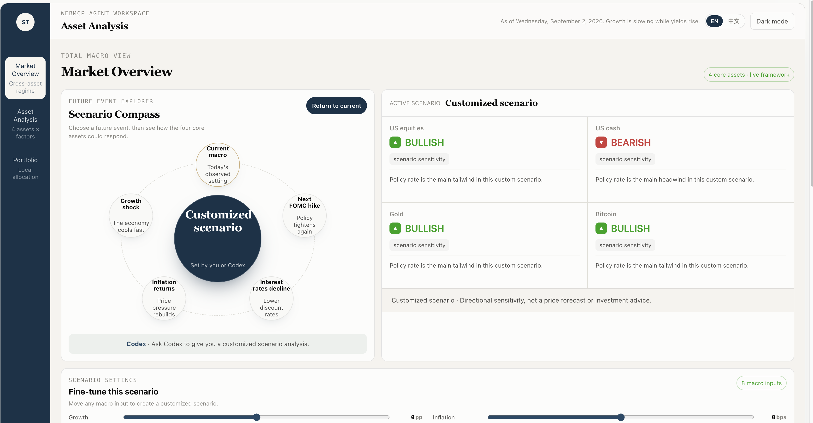
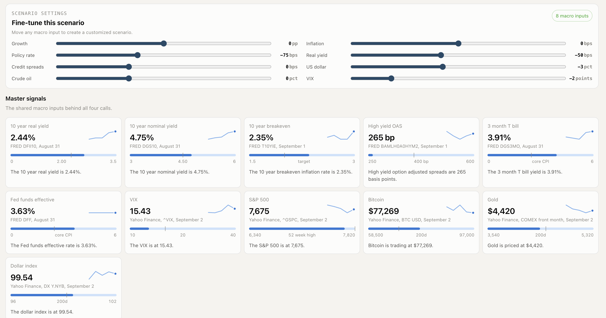
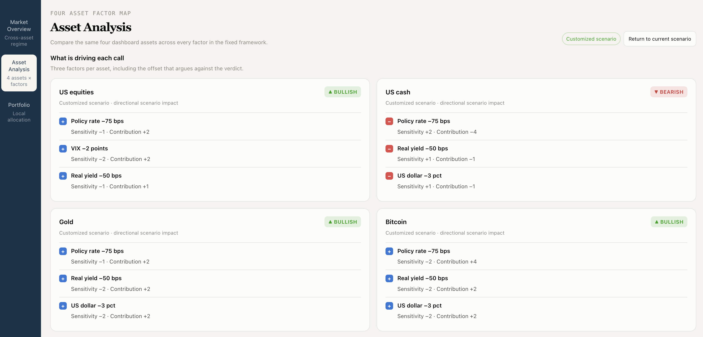
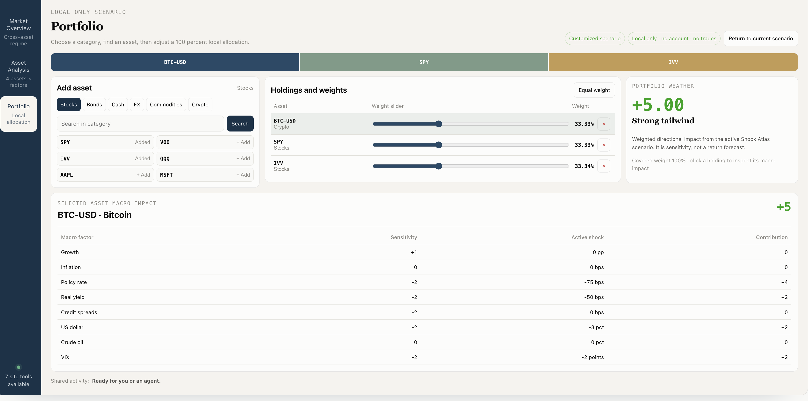

# Asset Analysis

> A live, WebMCP-enabled asset analysis workspace that shows how current and hypothetical macro conditions affect U.S. stocks, cash, gold, and crypto, then identifies the tailwinds and headwinds facing a portfolio.

[](https://superturbo.app/asset-analysis)
[](./LICENSE)

**Live app:** https://superturbo.app/asset-analysis

## Product views

### Market overview and scenario compass



### Scenario settings and market signals



### Four-asset factor analysis



### Portfolio analysis



## Why this exists

Macro analysis is both conversational and visual. An agent can interpret an open-ended question, but unconstrained answers may vary from one conversation to another. A fixed dashboard is consistent and inspectable, but it is difficult to customize for every event and portfolio.

Asset Analysis combines the two. The agent converts a user's request into validated, structured inputs. The dashboard applies the same factor framework every time and renders the result on the shared page, where the user can inspect the assumptions, evidence, and portfolio impact.

## What people and agents can do together

- Read the current fixed-factor regime across U.S. stocks, cash, gold, and crypto.
- Apply bounded growth, inflation, policy-rate, real-yield, credit-spread, U.S.-dollar, oil, and VIX shocks.
- Compare scenario sensitivity across SPY, QQQ, TLT, cash, DXY, gold, WTI, and Bitcoin.
- Search a Yahoo-compatible ticker and load keyless price, SEC, and news context.
- Render an evidence-cited macro lens for an asset.
- Set a local-only portfolio of up to 12 long-only positions totaling exactly 100%.
- See the portfolio's weighted tailwinds, headwinds, and evidence coverage on the same page.

The application is a research tool. It does not place trades, publish target prices, or provide personalized financial advice.

## WebMCP implementation

The top-level page imperatively registers seven site tools with `document.modelContext.registerTool(...)`. The tools call the same state, validation, and rendering functions as the visible human interface.

```js
document.modelContext.registerTool({
  name: "apply_macro_scenario",
  description: "Apply a named macro scenario to the shared page.",
  inputSchema: scenarioSchema,
  execute: applyScenario,
});
```

| Tool | Purpose |
|---|---|
| `get_macro_snapshot` | Read the current report, scenario, asset lenses, and portfolio. |
| `apply_macro_scenario` | Validate and apply a named macro scenario to the visible page. |
| `reset_macro_workspace` | Reset the shared local workspace. |
| `search_assets` | Search Yahoo Finance's public symbol directory. |
| `get_asset_context` | Load keyless price, SEC fundamentals when covered, and recent news. |
| `render_asset_lens` | Validate evidence IDs and render an agent-authored sensitivity lens. |
| `set_portfolio` | Validate and replace the local-only portfolio. |

Tool definitions use narrow JSON Schemas with `additionalProperties: false`. Read operations use `readOnlyHint`, while open-web results use `untrustedContentHint`. External text is rendered with `textContent`, not injected as HTML.

## Human-agent workflow

```text
Natural-language request
        ↓
ChatGPT or Chrome agent
        ↓ WebMCP tool call
Schema and runtime validation
        ↓
Shared scenario and portfolio state
        ↓
Visible dashboard update for human review
```

## Data and privacy

The current macro report is generated offline from public market and economic sources, then stored in `data/macro-dashboard.json`. Opening the dashboard does not call a model.

- FRED supplies rates, inflation, credit, growth, and fallback market series.
- Yahoo Finance supplies market prices and ticker discovery.
- SEC Companyfacts supplies normalized fundamentals for covered U.S. issuers.
- GDELT supplies recent coverage, with Yahoo news as a keyless fallback.
- Sources fail independently, and partial coverage is shown rather than invented.
- Portfolio holdings and generated lenses stay in browser `localStorage`.
- No account, API key, brokerage connection, or payment is required to use the dashboard.

## Project structure

| Path | Purpose |
|---|---|
| `app/asset-analysis/` | English and Chinese Asset Analysis routes. |
| `app/api/macro-dashboard/` | Public asset-search, asset-context, and dashboard endpoints. |
| `lib/macro/workspace.ts` | Scenario engine, schemas, portfolio calculation, and validation. |
| `lib/macro/workspace-ui.ts` | Visible workspace and imperative WebMCP registration. |
| `lib/macro/asset-context.ts` | Keyless external data aggregation and normalization. |
| `scripts/webmcp-selftest.mts` | Static WebMCP and validation test suite. |
| `scripts/macro-selftest.mts` | Macro data and bilingual output verification. |
| `template/macro-dashboard.html` | Base dashboard document. |
| `data/macro-dashboard.json` | Latest validated static macro report. |

This repository preserves the complete deployable SuperTurbo codebase because the production Vercel project serves multiple existing routes on `superturbo.app`.

## Run locally

Requirements: Node.js 22 or newer and npm.

```bash
git clone https://github.com/SuperTurbo-Services/Asset-Analysis.git
cd Asset-Analysis
npm install
npm run webmcp:selftest
npm run macro:selftest
npm run build
npm run dev
```

Open http://localhost:3000/asset-analysis.

The checked-in report and all WebMCP interactions run without credentials. `AI_GATEWAY_API_KEY` is needed only when regenerating the offline macro report with `npm run macro:refresh`; see [`.env.example`](./.env.example).

## Built with

Next.js, TypeScript, React, WebMCP, Zod, Vercel, Yahoo Finance, FRED, SEC Companyfacts, GDELT, and Codex.

## License

[MIT](./LICENSE) © 2026 SuperTurbo.
